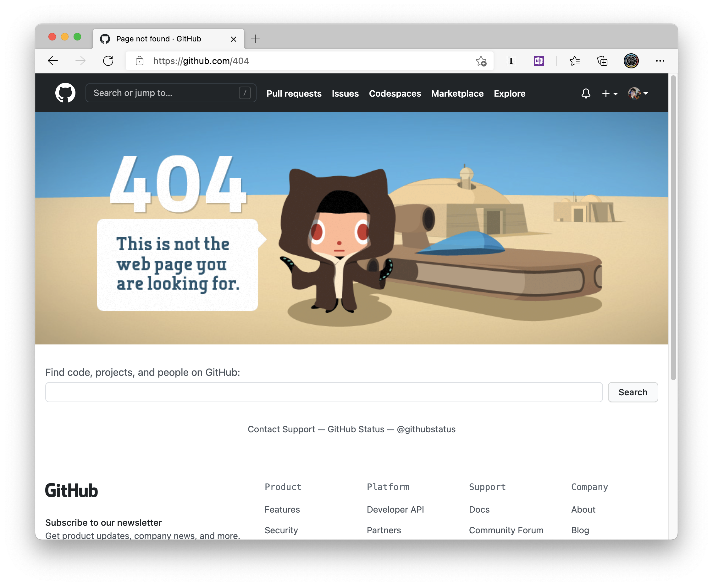

.. replit documentation master file, created by
   sphinx-quickstart on Mon Jun 22 18:35:18 2020.
   You can adapt this file completely to your liking, but it should at least
   contain the root `toctree` directive.

Welcome to Replit-py's User Guide!
==================================

\>\>\> ``import replit``
~~~~~~~~~~~~~~~~~~~~~~~~

This repository is the home for the ``replit`` Python package, which
provides:

-  A fully-featured database client for `Replit DB`_.
-  A Flask–based application framework for accellerating development on the platform.
-  Replit user profile metadata retreival (more coming here!).

& other helpful toys and utilities, like…

-  A simple audio library that can play tones and audio files!
-  Some helpful functions for displaying ANSI colors within interactive
   terminal sessions.

.. figure:: https://github.com/kennethreitz42/replit-py/blob/kr-cleanup/ext/readme.gif?raw=true

Something to note…
------------------

The Replit Python environment does not require any platform-specific
code, however, these optional utilities provide additional platform
features in a simple and accessible way.

*Example*: `Replit DB`_ is an HTTP service, but an optional Python
client (here!) is available.

.. _Replit DB: https://docs.repl.it/misc/database
.. _Repl.it: https://repl.it/

Building Websites and APIs
==========================

.. note:: This guide assumes that you are familiar with running code of some kind on Replit. If you aren’t, please refer to our `Quick Start Guide <https://docs.repl.it/misc/quick-start>`_.

In this tutorial, we are you going to build a Web Service – a process
that responds to incoming HTTP Requests, like the ones that come from
web browsers or even API Clients.

`HTTP <https://en.wikipedia.org/wiki/Hypertext_Transfer_Protocol>`_, if you aren’t familiar, is a protocol that allows modern
machines (and users of them) to interoperate. You use HTTP every time
you open an app on your phone that talks with the web. If you can’t
use an app on your phone without internet, it’s because it’s talking
to another computer (a server), mostly likely with HTTP.

The Basics
----------

Code can operate with HTTP in one of two ways:

1. Code can serve HTTP requests.
2. Code can consume HTTP responses.

These operations are not mutually exclusive, however. A web applications
can (and often do) perform both operations simultaneously. An example of
this is when a website serving incoming requests makes external calls to
backing APIs it is using to power it’s user experience. You’ll see an
example of this in the working demo we’ll link to in the end!

HTTP Requests
~~~~~~~~~~~~~

If you think you aren’t familiar with the concept of an actual HTTP
request, you may actually be mistaken! Here’s an overt example:

Every HTML page you visit is a distinct HTTP response. However, this one
is remarkable in that it is a 404 page. The ‘404: Not Found’ is known as
the HTTP Status Code.  There’s a full list of them:

`List of HTTP status codes - Wikipedia`_

The relevant ones are divided into four major categories, distinguished
by the first number:

-  ``2xx``: Success!
-  ``3xx``: Redirection — *a URL moved*.
-  ``4xx``:  Client Errors — *something went wrong on the consumption side*.
-  ``5xx``: Server Errors — *something went wrong on the server side*.

There’s a well-defined standard that declares these codes, and it is
known as `RFC 2616`_.

HTTP on Replit
--------------

The process of receiving incoming HTTP requests on Replit is very
straight forward: you simply open a port that is bound to the ``0.0.0.0``
host. That’s it! Replit will automatically give you a domain name, and
the interface will present you with a simple browser window that you can
check your frontend with.

The URL of your application (e.g. ``https://<app-name>.<user-name>.repl.co``) is publicly accessible.

.. _Repl.it: http://repl.it/
.. _List of HTTP status codes - Wikipedia: https://en.wikipedia.org/wiki/List_of_HTTP_status_codes
.. _RFC 2616: https://tools.ietf.org/html/rfc2616

.. _code-samples:
.. :ref:`installed <install>`

Code Samples
============

Here are a carefully curated collection of code samples for utilizing the ``replit`` Python library:

Hello, World!
~~~~~~~~~~~~~

Here's a basic "Hello, World!" example, using the web framework provided:

::

   from replit import web

   app = web.App(__name__)

   @app.route("/")
   def index():
      return "Hello, World!"

   app.run()

Adding Required Replit Login
~~~~~~~~~~~~~~~~~~~~~~~~~~~~

In this example, we are requiring that a Replit user sign in with their Replit user account in order to see the "Hello, World!":

::

   from replit import web

   app = web.App(__name__)

   @web.needs_sign_in(login_res=f"Hello! {web.login_snippet}")
   def index():
      return "Hello, World!"

   app.run()

Getting a User's Profile Information
~~~~~~~~~~~~~~~~~~~~~~~~~~~~~~~~~~~~

In this next example, we will take the logged in user's profile information and present it in API form:

::

   from replit import web, get_profile

   app = web.App(__name__)

   @web.needs_sign_in(login_res=f"Hello! {web.login_snippet}")
   def index():
      username = web.whoami()

      payload = {}
      payload["greetings"] = True
      payload["profile"] = get_profile(username).as_dict

      return payload

   app.run()

Here's the example API response:

::

   $ curl https://replit-py-code-sample.kennethreitz42.repl.co/
   {
      "greetings": true,
      "profile": {
         "avatar_url": "https://storage.googleapis.com/replit/images/1609937177761_8ce62c49dfd5f0192cff5d3684f78a21.jpeg",
         "bio": "Software Engineer focused on abstractions, reducing cognitive overhead, and Design for Humans.",
         "name": "Kenneth Reitz",
         "username": "kennethreitz42"
      }
   }

Pretty useful!

You could use this to build your own social tools based around the Replit community.

ReplTweet Example
~~~~~~~~~~~~~~~~~

A more fully–fledged example is a Repl we have available known as ReplTweet. It is a Twitter clone!

- `https://repl.it/@kennethreitz42/repltweet <https://repl.it/@kennethreitz42/repltweet>`_
- `https://github.com/replit/example-repltweet <https://github.com/replit/example-repltweet>`_

Check out the Repl and the GitHub repo to see it in action and learn more about how to use
this library to your full advantage!

API Reference
=============

.. toctree::
   :maxdepth: 2

   api

Indices and tables
==================

* :ref:`genindex`
* :ref:`modindex`
* :ref:`search`
